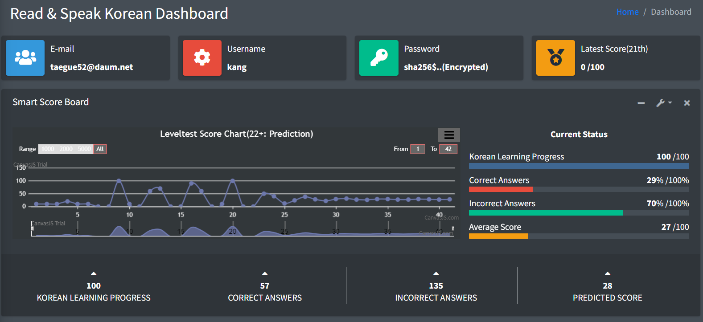
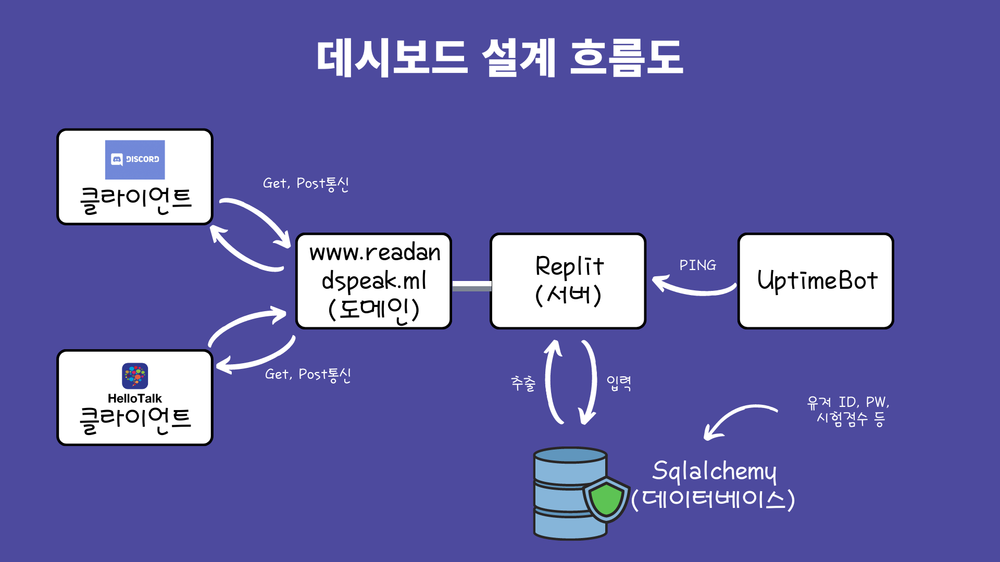

# Description of Read-Speak_Korean_Webapp(RSKWP)
"Read-Speak_Korean_Webapp_Prediction(RSKWP)" is an web application focusing on web and prediction functionality. If you want to predict scores based on our model, check out the latest repository in Github. Explanation video(KR) of RSKWP is in below and see results at https://www.readandspeak.ml/ 



[](https://www.canva.com/design/DAEzIHL7dio/AdGFUXZPWOr60XDsQTv72A/view?utm_content=DAEzIHL7dio&utm_campaign=designshare&utm_medium=link&utm_source=publishsharelink)

## RSKWP Dependencies
This application is built in Flask web-framework along with Python. In advance, we recommend to install prerequisites in the command line.

## Linear Regression
Following code is the implementation of Linear Regression belonging to our platform. 
```rb
    #Prediction-------------------------------
    score_list = []
    prediction_list = []
    pp_prediction_list= []
    Pearson = []
    res_prediction_score = 0
    res_res_prediction_score = 0
    tag = "D"

    if len(current_user.scores) < 3:
      predicted_score = 0
    else:
      X_train = []
      Y_train = []

      lin_reg = LinearRegression()

      for x in range(0, len(current_user.scores)):
        prediction_list.append(current_user.scores[x].data)
        if(x < 2):
          pass
        else:
          X_train.append([current_user.scores[x-2].data, current_user.scores[x-1].data])
          Y_train.append([current_user.scores[x].data])


      X_train = np.array(X_train)
      Y_train = np.array(Y_train)

      reg = lin_reg.fit(X_train, Y_train)

      predicted_score = reg.predict(np.array([[current_user.scores[-2].data,current_user.scores[-1].data]]))

      predicted_score= round(predicted_score[0][0])

      if(predicted_score < 0):
        predicted_score = 0
      elif(predicted_score > 100):
        predicted_score = 100

      prediction_list.append(predicted_score)
      print(prediction_list)


      length = len(prediction_list)-3

      

      for x in range(0, 20): 
        lX_train = []
        lY_train = []
        for a in range(0, len(prediction_list)):
          if(a < len(prediction_list)-2):
            lX_train.append([prediction_list[a], prediction_list[a+1]])
            lY_train.append([prediction_list[a+2]])

        lX_train = np.array(lX_train)
        lY_train = np.array(lY_train)

        lreg = lin_reg.fit(lX_train, lY_train)

        lpredicted_score = lreg.predict(np.array([[prediction_list[-2],prediction_list[-1]]]))

        lpredicted_score= round(lpredicted_score[0][0])

        if(lpredicted_score < 0):
          lpredicted_score = 0
        elif(lpredicted_score > 100):
          lpredicted_score = 100

        prediction_list.append(lpredicted_score)

        lX_train = lX_train.tolist()
        lY_train = lY_train.tolist()

      print(lX_train)
      print(lY_train)

      
      print(length)

      pp_prediction_list = lY_train[length:]
      print(pp_prediction_list)


      res_prediction_score = pp_prediction_list[-1]

      res_res_prediction_score = res_prediction_score[0]

      if len(current_user.scores) >= 3:
        if(res_res_prediction_score >= 70):
          tag = "A"
        elif(res_res_prediction_score < 70 and res_res_prediction_score >= 40):
          tag = "B"
        else:
          tag = "C"

      
          

    #End of Prediction-------------------------------

    #Prediction Average 
    avg_res = 0

    avg = 0
    num = 0
    if len(current_user.scores) >= 3:
      for n in current_user.scores:
        num +=1
        y = n.data
        score_list.append(n.data)
        avg += y
      
      for x in pp_prediction_list:
        num+=1
        y = x[0]
        avg += y

      avg_res = avg / num
      avg_res = round(avg_res)

    #End of Prediction Average-------------------------
    
    if len(current_user.scores) >= 3:
      final_list = score_list + res_prediction_score

    #print(final_list)

    #Skewness
    if len(current_user.scores) >= 3:
      skew_final = skew(final_list)
    else:
      skew_final = 0

    #Kurtosis
    if len(current_user.scores) >= 3:
      kurt_final = kurtosis(final_list)
    else:
      kurt_final = 0

    #Variance
    if len(current_user.scores) >= 3:
      var_final = np.var(final_list,ddof=1)
    else:
      var_final = 0

    #Standard_Deviation
    if len(current_user.scores) >= 3:
      std_final = np.std(final_list)
    else:
      std_final = 0

    #Minimum Value
    if len(current_user.scores) >= 3:
      min_final = min(final_list)
    else:
      min_final = 0

    #Maximum_Value
    if len(current_user.scores) >= 3:
      max_final = max(final_list)
    else:
      max_final = 0

    #Maximum_Value
    if len(current_user.scores) >= 3:
      data = np.array(final_list)
      q3, q1 = np.percentile(data, [75 ,25])
      iqr = q3 - q1
    else:
      iqr = 0

    #Pearson Correlation
    if len(current_user.scores) >= 3:
      for m in range(0, len(final_list)):
        Pearson.append(m+1)

      correlation, p_value = pearsonr(Pearson, final_list)

    else:
      correlation = 0

    #Covariance
    if len(current_user.scores) >= 3:
      covariance = np.cov(Pearson, final_list)[0,1]

    else:
      covariance = 0

    #User Analysis
    U_B = 0
    U_I = 0
    U_A = 0
    U_all = User.query.all()
    

    for u in range(0, len(U_all)):

      sum = 0
      aveg = 0
      for m_m in range(0, len(U_all[u].scores)):
        sum += U_all[u].scores[m_m].data
        

      if(len(U_all[u].scores) >=1):
        aveg = sum / len(U_all[u].scores)
      else:
        aveg = 0


      if(aveg >=70):
        U_A+=1
      elif(aveg <70 and aveg >= 30):
        U_I+=1
      else:
        U_B +=1

    print(U_B)
    print(U_I)
    print(U_A)
```

## RSKWP Environments and References
RSK_Webapp is implemented in(with)
* Flask
* HTML, CSS, Javascript 
* Numpy, Scipy
* Sqlalchemy
* werkzeug.sercurity
* Replit
* Uptimebot
* 도메인
* 구글 차트
* Canvasjs
* https://adminlte.io/



## RSKWP Implementation
Try out our web-service registering a membership in https://www.readandspeak.ml/

## Error Detection #1
If you face a problem belong to sql-alchemy we highly advise to report throughout an e-mail. The adress is taegue52@daum.net. 
